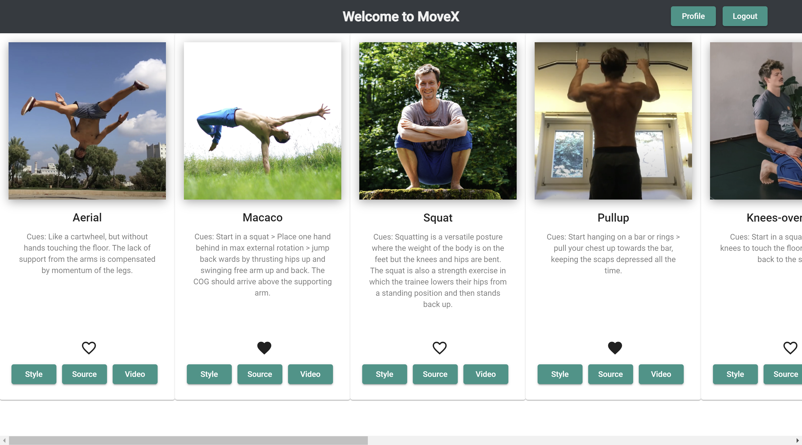

# MoveXAngularClient
MoveX is a library of movements from various styles and traditions, with descriptions/cues and video sources.

The app is built using the MEAN tech stack: MongoDB, Angular, Express.js, Node.js. 
Angular Material is applied for UI design.

This repo is a single-page, responsive Angular frontent. It was generated with [Angular CLI](https://github.com/angular/angular-cli) version 12.2.11.
There is also a [React Client](https://github.com/MitoMonkey/MoveX-client.
The backend can be found here: [MoveX backend](https://github.com/MitoMonkey/MoveX-backend)

API and client were created as a study project during my Fullstack Webdeveloper course @CarrerFoundry.

## Live Demo
[Live app](https://mitomonkey.github.io/MoveX-Angular-client/welcome)

## Features
* View a list of all moves
* See details for each move
* See details about a style
* See details about a source
* Allow new users to register and login
* Allow users to update their user info (username, password, email, date of birth)
* Allow users to add a move to their list of favorites
* Allow users to remove a move from their list of favorites 
* Allow existing users to deregister 

## Documentation
* [TypeDoc documentation](./docs/index.html) was created using `npx typedoc --out docs src/ --entryPointStrategy expand --exclude **/*.spec.ts`

All API endpoints can be found here: [MoveX API documentation](https://move-x.herokuapp.com/documentation.html)

## Development server
Run `ng serve --open` for a dev server. Navigate to `http://localhost:4200/`. The app will automatically reload if you change any of the source files.

## Code scaffolding
Run `ng generate component component-name` to generate a new component. 
You can also use `ng generate directive|pipe|service|class|guard|interface|enum|module`.

## Build
Run `ng build` to build the project. The build artifacts will be stored in the `dist/` directory.
Deploy on GitHub pages: `ng deploy --base-href=/MoveX-Angular-client/`

## Running unit tests
Run `ng test` to execute the unit tests via [Karma](https://karma-runner.github.io).

## Running end-to-end tests
Run `ng e2e` to execute the end-to-end tests via a platform of your choice. To use this command, you need to first add a package that implements end-to-end testing capabilities.

## Further help
To get more help on the Angular CLI use `ng help` or go check out the [Angular CLI Overview and Command Reference](https://angular.io/cli) page.

## Things that could be improved
* Form validation (a thorough version is implemented in the react version. The topic was neglected in the Angular version, as it is just a study project with a different focus).
* Deleting an account or updating user data should require a password confirmation.
* A new "SingleMove" component, similar to MoveCard could be added to show individual moves (with details) in ProfileView (favorites), StyleView and SourceView.
* Mat-dialog does not seem to perfectly responsive. At least vertical scrolling does not always appear…
